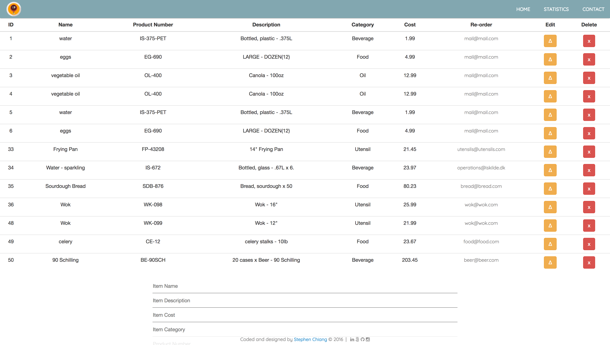

# Summary
A web-app for a F&B manager who wishes to check on consumption and re-order. This is a RESTful web-app developed on a MAMP stack consisting of the Java JPA API, the Spring framework with REST and AJAX, JavaScript/jQuery and a MySQL database. The user is able to manipulate data from the databse and create, update, delete, and review overall tracking statistics which are updated asynchronously based on user input. **This app was refactored with AngularJS on 30 April 2017**.

I also wrote basic JUnit tests to ensure proper mapping of the entities as well as the basic routes to ensure the right data was being requested and returned. Form validation for the cost field was implemented to ensure that it was a number type data and rounded to 2 decimals.

This was the first I have attempted to implement a RESTful app with a database.

Issues I ran into:
- Basic CRUD and sorting of data was easy, however, the aggregation of statistics required additional JavaScript and jQuery support to properly manipulate and pass on to different functions and listeners in the appropriate sequence to account for the asynchronous nature of the web-app.

**The difficulty in sorting and manipulating data was significantly reduced after refactoring with AngularJS by building functions that took the category directly and used AngularJS sorting methods.**

If more time were available:
    - Fuzzy Search.
    - Login/Logout.
    - Importing a chart library to provide visual support to the user such as ChartJS.
    - Additional data fields such as date or a second layer of quantity (e.g., 2 pallets of 60 cartons).

<p align="center">

</p>
<p align="center">

<p>

1. [How to Execute](#how-to-execute)
2. [Code Example](#code-examples)

## How to Execute

- The web-app is hosted on my AWS server: [**here**](http://www.chiangs.ninja:8080/TrackerREST/)

## Instructions

1. User arrives on summary page to see Overview of Consumption by category.
2. Second tab allows user to add/delete/edit/sort the entire list of items where data is returned without refreshing page.

## Code Examples

Here's a snippit of the logic I used to dynamically identify the unique categories property of each object and then counted how many items in the total database for each category. First, the unique categories were pulled into a new array. I then loop through the original array of all objects and increase the counter when their category properties match with each of the categories in the unique category array.

```javascript
var getUniqueCats = function(data) {
    var $tr = $('<tr>');
    var unique = {};
    var distinctCat = [];
    for ( var i in data) {
        if (typeof (unique[data[i].category]) == "undefined") {
            distinctCat.push(data[i].category);
        }
        unique[data[i].category] = 0;
    } for (var i = 0; i < distinctCat.length; i++) {
        var $td2 = $('<td>'+ getCount(distinctCat[i], data)+'</td>');
        $('#'+i).append($td2);
    }
}

var getCount = function(category, data) {
	var counter = 0;
	for (var i = 0; i < data.length; i++) {
		if ( data[i].category == category) {
			counter++
		}
	}
		return counter;
}
```

Here is the same functionality refactored to AngularJS, which was moved to the HTML side and then 2 simple functions were written in the controller for the other two categories of the summary table in addition to a ng-class that dynamically responds to a total cost per category to visually assist the user.
```html
<div id="summaryTable">
	<table class="table">
		<thead>
			<tr class="bold">
				<td>Category</td>
				<td>Qty Consumed</td>
				<td>Total Cost</td>
			</tr>
		</thead>
		<tbody>
			<tr ng-repeat="c in vm.consumables | unique: 'category'">
				<td>{{c.category}}</td>
				<td>{{vm.qtyConsumed(c.category)}}</td>
				<td ng-class="vm.budgetStatus(c.category)">{{vm.totalCatCost(c.category) | currency:'€ '}}</td>
			</tr>
		</tbody>
	</table>
</div>
```
```JavaScript
vm.qtyConsumed = function(category) {
			var counter = 0;
			for (var i = 0; i < vm.consumables.length; i++) {
				if (vm.consumables[i].category == category) {
					counter++;
				}
			}
			return counter;
		}

		vm.totalCatCost = function(category) {
			var total = 0;
			for (var i = 0; i < vm.consumables.length; i++) {
				if (vm.consumables[i].category == category) {
					total = total + vm.consumables[i].cost;
				}
			}
			return total;
		}

		vm.budgetStatus = function(category) {
			var totalCost = vm.totalCatCost(category);
			if (totalCost > 200)
				return 'danger';
			if (totalCost > 90)
				return 'warning';
			return 'safe';
		}
```

## Technologies Used

- Java JPA API
- Spring STS
- Gradle Managed Dependencies
- MySQL
- REST / AJAX
- HTML
- CSS and Bootstrap
- JavaScript / jQuery
- AngularJS
